# Отчет по разработке сайта "Архитектура игровой консоли"

## Введение
Данный отчет описывает процесс разработки веб-сайта, посвященного экосистеме игровой консоли. Сайт включает информацию о консоли, геймпаде (если имеется), и ключевых аспектах функционирования. В проекте использовались современные CSS-фреймворки (Bootstrap и/или TailwindCSS) для создания привлекательного и функционального дизайна.

## Структура проекта

Проект был структурирован согласно техническому заданию и состоит из следующих ключевых блоков:
1. **Блок консоли** – содержит изображение консоли, а также описания ее функциональных особенностей, таких как порты, настройки и подключенные устройства.
2. **Блок геймпада** – если у консоли есть геймпад, то в блоке отображаются кнопки управления.
3. **Блок информации** – включает в себя детали о пользователе, играх, и общую информацию о консоли и экосистеме.

Для построения приложения было реализовано не менее шести классов, каждый из которых находится в отдельном файле, как указано в требованиях.

## Реализация
Для реализации проекта использовались следующие технологии:
- **React**: фреймворк позволяющий создавать компоненты и создавать удобную верстку.
- **JavaScript**: для интерактивных элементов, таких как переключение состояния консоли.
- **Tailwind**: использовался TailwindCSS для обеспечения адаптивного и удобного дизайна.
- **Git**: управление версиями проекта, работа с ветками и разрешение конфликтов.
- **Сборщик Vite**: для удобного и быстрого взаимодействия всех элементов внутри проекта.

## Распределение обязанностей
- Разработка макета будущего проекта, создание SCSS стилей, а так же разработка таких 
компонентов как SlideRight.jsx, SlideLeft.jsx, PowerButton и FavGame и реализация этих 
функций в основном файле проекта лежала на Агате. 
Помимо этого ею была расписана логика скрытия и появления кнопок по клику
и функция смены состояния экрана.


- Даниил занимался разработкой классов, модальных окон и компонентов отвечающих за 
логику их взаимодействия внутри файла основного проекта. 
Так же были разработаны анимации и некоторые стили

## Требования к приложению

### Основные классы
В проекте было реализовано четыре обязательных класса, каждый из которых имеет свои особенности:

1. **User**
    - Содержит информацию о пользователе:
        - Имя
        - Логин
        - Email
        - Баланс
        - Друзья (список)
        - Методы для управления балансом и друзьями.

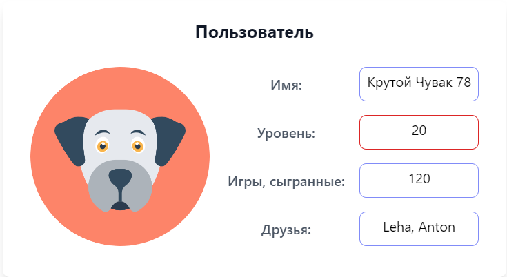

```js
// User.jsx
class User {
    #id; // Приватное поле id
    username;
    level;
    gamesPlayed;
    friends;
    image;
    firstname;
    lastname;
    phone;
    email;
    balans;

    constructor({ id, username, level, gamesPlayed, friends, image, firstname, lastname, phone, email, balans }) {
        this.#id = id; // Инициализация приватного поля id
        this.username = username;
        this.level = level;
        this.gamesPlayed = gamesPlayed;
        this.friends = friends;
        this.image = image; // Инициализация свойства image
        this.firstname = firstname;
        this.lastname = lastname;
        this.phone = phone;
        this.email = email;
        this.balans = balans;
    }

    // Метод для получения идентификатора, если это необходимо
    getId() {
        return this.#id;
    }

    toFormattedString() {
        return JSON.stringify({
            // Не выводим id
            username: this.username,
            level: this.level,
            gamesPlayed: this.gamesPlayed,
            friends: this.friends,
            image: this.image,
            firstname: this.firstname,
            lastname: this.lastname,
            phone: this.phone,
            email: this.email,
            balans: this.balans,
        }, null, 2);
    }
}

export default User;
```

2. **Console**
    - Описывает консоль:
        - Название консоли
        - Наличие гарантии
        - Количество и типы портов
        - Настройки системы (fps, Hz, HDR, Remote Play, Dolby Atmos)
        - Подключенные геймпады
    - Интерактивные элементы для включения/выключения консоли и управления настройками.

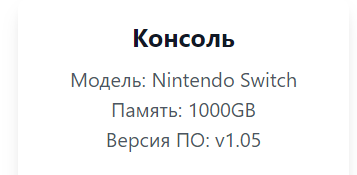

```js
// src/data/console.jsx
class Console {
    constructor(model, storage, firmwareVersion) {
        this.model = model;
        this.storage = storage;
        this.firmwareVersion = firmwareVersion;
    }

    getModel() {
        return this.model;
    }

    getStorage() {
        return this.storage;
    }

    getFirmwareVersion() {
        return this.firmwareVersion;
    }

    toString() {
        return `Консоль: Модель ${this.model}, Память: ${this.storage}GB, Версия ПО: ${this.firmwareVersion}`;
    }
}

export default Console;
```
    
3. **Menu**
    - Меню отображает список доступных игр и содержит методы для управления ими.
    - Поля:
        - Массив игр
        - Количество игр

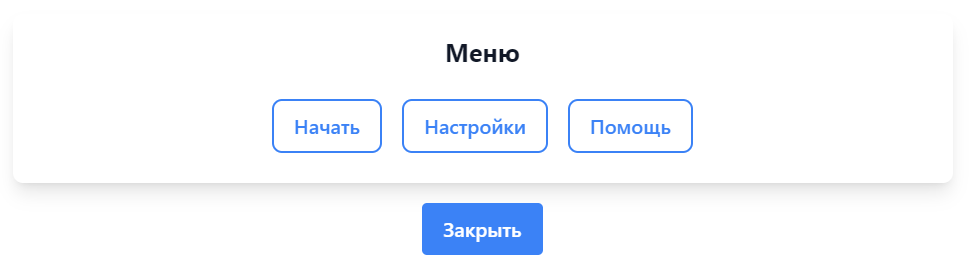

```js
// menu.jsx
class Menu {
    items;

    constructor(items) {
        this.items = items;
    }

    getItems() {
        return this.items;
    }

    // Статический метод для фильтрации элементов меню
    static filterItems(items) {
        return items.filter(item => !item.startsWith("Удалить")); // Фильтрация элементов
    }

    // Метод для возврата данных в виде строки
    toFormattedString() {
        return `Меню: ${this.items.join(", ")}`;
    }

    toString() {
        return `Меню: Опции: ${this.items.join(", ")}`;
    }
}

export default Menu;
```

4. **Game**
    - Описывает игру:
        - Название игры
        - Количество проведенных часов
        - Дата релиза
        - Достижения (достигнуто/всего)

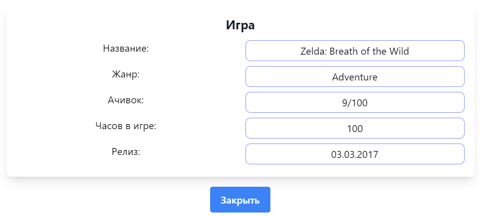

```js
class Game {
    title;
    genre;
    rating;
    hours;
    realis;

    constructor(title, genre, rating, hours, realis) {
        this.title = title;
        this.genre = genre;
        this.rating = rating;
        this.hours = hours;
        this.realis = realis;
    }

    getTitle() {
        return this.title;
    }

    getGenre() {
        return this.genre;
    }

    getRating() {
        return this.rating;
    }

    getHours() {
        return this.hours;
    }

    Relis(){
        return this.realis;
    }

    toString() {
        return `${this.title} ${this.genre} ${this.rating} ${this.hours} ${this.realis}`;
    }
}

export default Game;
```

### Дополнительные требования
5. **Store**
   - Отображает игры в формате карточек выводя из массива:
   
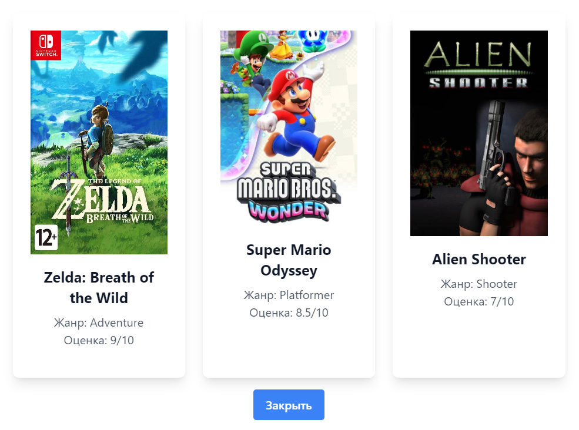

```js
class Store {
    gamesAvailable;
    currency;

    constructor(gamesAvailable, currency) {
        this.gamesAvailable = gamesAvailable;
        this.currency = currency;
    }

    getGamesAvailable() {
        return this.gamesAvailable;
    }

    getCurrency() {
        return this.currency;
    }

    toString() {
        return `Игры: ${this.gamesAvailable.length} игры доступны, Источник: ${this.currency}`;
    }
}

class Games extends Store {
    title;
    genre;
    rating;

    getTitle() {
        return this.title;
    }

    getGenre() {
        return this.genre;
    }

    getRating() {
        return this.rating;
    }

    toString() {
        return `Игра: ${this.title} (Жанр: ${this.genre}, Рейтинг: ${this.rating}/10)`;
    }
}


export default Store;
```

6. **Special**
- Отображает специальные параметры/возможности пользователю

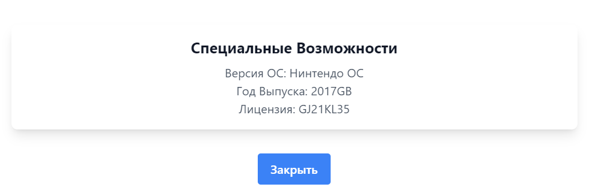

```js
// src/data/console.jsx
class Special {
    constructor(os, year, licens) {
        this.os = os;
        this.year = year;
        this.licens = licens;
    }

    getOs() {
        return this.os;
    }

    getYear() {
        return this.year;
    }

    getLicens() {
        return this.licens;
    }

    toString() {
        return `${this.licens}, ${this.year}, ${this.licens}`;
    }
}

export default Special;
```

7. **System**
- Класс наследующий параметры Console и добавляющий свои

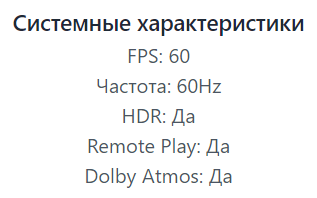

```js
// src/data/System.jsx
import Console from "./Console"; // Импорт базового класса

class System extends Console {
    constructor(model, storage, firmwareVersion, fps, Hz, isHDR, remotePlay, dolbyAtmosSound) {
        super(model, storage, firmwareVersion);
        this.fps = fps;
        this.Hz = Hz;
        this.isHDR = isHDR;
        this.remotePlay = remotePlay;
        this.dolbyAtmosSound = dolbyAtmosSound;
    }

    toString() {
        return `Система: ${super.toString()}, FPS: ${this.fps}, Частота: ${this.Hz}Hz, HDR: ${this.isHDR ? 'Да' : 'Нет'}, Remote Play: ${this.remotePlay ? 'Да' : 'Нет'}, Dolby Atmos: ${this.dolbyAtmosSound ? 'Да' : 'Нет'}`;
    }
}

export default System;
```

## Компоненты

1. **ConsoleInfo**

- Выводит информацию о консоли и ее параметрах системы из файла System.js


```js
import React from "react"; 
// Импортируем React, который необходим для работы с JSX и создания компонентов.

import System from "../data/System.js"; 
// Импортируем модуль System, который содержит описание системных характеристик. Проверяем правильность пути.

// Функция для отображения системных характеристик
const renderSystemInfo = (system) => {
    return (
        // Обертка для системной информации с отступом сверху
        <div className="mt-4">
            {/* Заголовок раздела с системной информацией */}
            <h3 className="text-lg font-semibold text-gray-800">Системные характеристики</h3>
            
            {/* Отображение FPS */}
            <p className="text-gray-600">FPS: {system.fps}</p>
            
            {/* Отображение частоты в герцах */}
            <p className="text-gray-600">Частота: {system.Hz}Hz</p>
            
            {/* Проверка и отображение, поддерживается ли HDR */}
            <p className="text-gray-600">HDR: {system.isHDR ? 'Да' : 'Нет'}</p>
            
            {/* Проверка и отображение наличия функции Remote Play */}
            <p className="text-gray-600">Remote Play: {system.remotePlay ? 'Да' : 'Нет'}</p>
            
            {/* Проверка и отображение поддержки Dolby Atmos */}
            <p className="text-gray-600">Dolby Atmos: {system.dolbyAtmosSound ? 'Да' : 'Нет'}</p>
        </div>
    );
};
// Эта функция получает объект system и отображает информацию о его характеристиках.

// Компонент для отображения информации о консоли
function ConsoleInfo({ console }) {
    return (
        // Основной блок с информацией о консоли, обрамленный стилями (отступы, фон, тени и закругленные углы)
        <div className="mb-4 mt-4 bg-white shadow-lg rounded-lg p-4 ">
            {/* Заголовок с информацией о консоли */}
            <h2 className="text-xl font-bold text-gray-900 mb-2">Консоль</h2>
            
            {/* Отображение модели консоли */}
            <p className="text-gray-600">Модель: {console.model}</p>
            
            {/* Отображение объема памяти консоли */}
            <p className="text-gray-600">Память: {console.storage}GB</p>
            
            {/* Отображение версии программного обеспечения консоли */}
            <p className="text-gray-600">Версия ПО: {console.firmwareVersion}</p>

            {/* Если объект console является экземпляром класса System, вызываем функцию renderSystemInfo, иначе ничего не показываем */}
            {console instanceof System ? renderSystemInfo(console) : null}
        </div>
    );
}
// Этот компонент получает объект console и отображает его свойства. Если консоль является экземпляром System, выводятся также системные характеристики.

export default ConsoleInfo; 
// Экспортируем компонент ConsoleInfo для использования в других частях приложения.
```
2. **FavGame**

- Компонент содержащий в себе верстку статьи о любимой игре

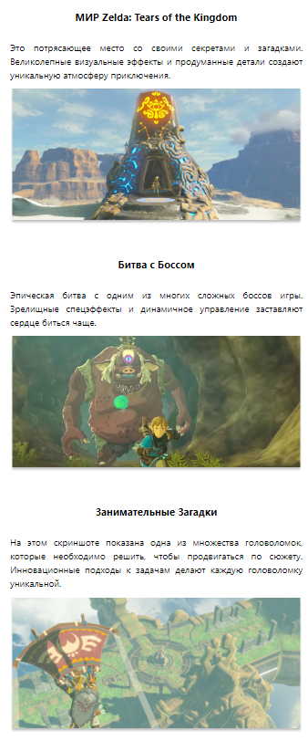

```js
import React from 'react'; // Импорт библиотеки React
import styles from "../Core.module.scss"; // Импорт CSS модулей для стилизации
import zeldaOne from '../../public/zelda-1.png'; // Импорт первой картинки Zelda
import zeldaTwo from '../../public/zelda-2.png'; // Импорт второй картинки Zelda
import zeldaThree from '../../public/zelda-3.png'; // Импорт третьей картинки Zelda
import zeldaFour from '../../public/zelda-4.png'; // Импорт четвертой картинки Zelda

// Основная функциональная компонента FavGame
export default function FavGame() {
    return (
        <div>
            <div className={styles.fav_game}> // Секция с первой картинкой и описанием
                <h2 className={styles.fav_h}>МИР Zelda: Tears of the Kingdom</h2>
                <p className={styles.fav_p}>
                    Это потрясающее место со своими секретами и загадками.
                    Великолепные визуальные эффекты и продуманные детали
                    создают уникальную атмосферу приключения.
                </p>
                 // Первая картинка
            </div>
            <div className={styles.fav_game}> // Секция со второй картинкой и описанием
                <h2 className={styles.fav_h}>Битва с Боссом</h2>
                <p className={styles.fav_p}>
                    Эпическая битва с одним из многих сложных боссов игры.
                    Зрелищные спецэффекты и динамичное управление заставляют сердце биться чаще.
                </p>
                 // Вторая картинка
            </div>
            <div className={styles.fav_game}> // Секция с третьей картинкой и описанием
                <h2 className={styles.fav_h}>Занимательные Загадки</h2>
                <p className={styles.fav_p}>
                    На этом скриншоте показана одна из множества головоломок, которые
                    необходимо решить, чтобы продвигаться по сюжету. Инновационные
                    подходы к задачам делают каждую головоломку уникальной.
                </p>
                 // Третья картинка
            </div>
            <div className={styles.fav_game}> // Секция с четвертой картинкой и описанием
                <h2 className={styles.fav_h}>Мир Игры</h2>
                <p className={styles.fav_p}>
                    Пейзаж открытого мира с его природными красотами и разнообразными биомами.
                    Игроки могут свободно исследовать огромные территории, находить
                    скрытые объекты и выполнять побочные квесты.
                </p>
                 // Четвертая картинка
            </div>
        </div>
    );
}
```
3. **GameInfo**

- Выводит информацию об игре и ее полях из файла Game.js


```js
import React from "react";

// Компонент для отображения информации об игре
function GameInfo({ game }) {
    return (
        <div className="bg-white shadow-lg rounded-lg p-4">
            <h2 className="text-xl font-bold text-gray-900 mb-2">Игра</h2>
            <p className="grid grid-cols-2 gap-4 py-1">
                Название: <span className="border border-indigo-400 rounded-lg px-2 py-1">{game.title}</span>
            </p>
            <p className="grid grid-cols-2 gap-4 py-1">
                Жанр: <span className="border border-indigo-400 rounded-lg px-2 py-1">{game.genre}</span>
            </p>
            <p className="grid grid-cols-2 gap-4 py-1">
                Ачивок: <span className="border border-indigo-400 rounded-lg px-2 py-1">{game.rating}/100</span>
            </p>
            <p className="grid grid-cols-2 gap-4 py-1">
                Часов в игре: <span className="border border-indigo-400 rounded-lg px-2 py-1">{game.hours}</span>
            </p>
            <p className="grid grid-cols-2 gap-4 py-1">
                Релиз: <span className="border border-indigo-400 rounded-lg px-2 py-1">{game.realis}</span>
            </p>
        </div>
    );
}

export default GameInfo;
```
4. **GameList**

- Выводит список игр в формате карточек из файла Store.js


```js
import React from "react"; // Импортируем библиотеку React для создания компонентов

// Компонент для отображения списка игр
function GameList({ games }) { // Деструктурируем пропсы и получаем массив игр
    return (
        <div className="grid grid-cols-1 md:grid-cols-2 lg:grid-cols-3 gap-6"> 
            {games.map((game, index) => ( // Итерируемся по массиву игр, создавая элемент для каждой игры
                <div
                    key={index} // Уникальный ключ для каждого элемента списка, чтобы React мог отслеживать изменения
                    className="bg-white shadow-lg rounded-lg overflow-hidden transform transition-all duration-300 hover:scale-105 hover:shadow-2xl hover:border hover:border-indigo-400 cursor-pointer w-full max-w-lg p-6" // Стили для элемента игры с анимацией и эффектами при наведении
                >
                    
                    <div className="p-4">
                        <h2 className="text-xl font-bold text-gray-900 mb-2">{game.title}</h2>
                        <p className="text-gray-600">Жанр: {game.genre}</p> 
                        <p className="text-gray-600">Оценка: {game.rating}/10</p> 
                    </div>
                </div>
            ))}
        </div>
    );
}

export default GameList; // Экспортируем компонент для использования в других частях приложения
```
5. **Header**

- Компонент содержащий в себе верстку названия консоли


```js
export default function Header() {
    return (
        <>
            <h1 className='mb-20 text-blue-950'>Игровая Консоль Nintendo Switch</h1>
        </>
    )
}
```
6. **InterfaceButtons**

Компонент состоящий из кнопок которые вызывают функции GameInfo, GameList, SettingsInfo, SpecialInfo, MenuInfo.

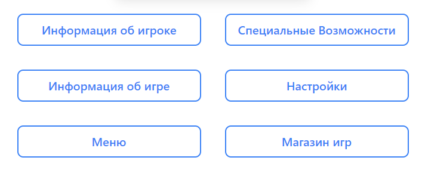

```js
import React from "react"; // Импортируем библиотеку React для создания компонентов

import GameList from "./GameList.jsx"; // Импортируем компонент GameList
import UserInfo from "./UserInfo.jsx"; // Импортируем компонент UserInfo
import SettingsInfo from "./SettingsInfo.jsx"; // Импортируем компонент SettingsInfo
import MenuInfo from "./MenuInfo.jsx"; // Импортируем компонент MenuInfo
import GameInfo from "./GameInfo.jsx"; // Импортируем компонент GameInfo
import SpecialInfo from "./SpecialInfo.jsx"; // Импортируем компонент SpecialInfo

// Компонент для отображения кнопок интерфейса
function InterfaceButtons({ openModal, user1, console1, game1, settings1, menu1, store1 }) { // Деструктурируем пропсы, получаем функции и объекты
    return (
        <div className="grid grid-cols-2 gap-4">
            <button
                onClick={() => openModal(<UserInfo user={user1} />)} // Обработчик клика, открывающий модальное окно с компонентом UserInfo
                className="px-4 py-2 m-2 border-2 border-blue-500 rounded-lg bg-white text-blue-500 hover:bg-gradient-to-r from-blue-400 to-blue-600 hover:text-white transition-all duration-500 ease-in-out" // Стили для кнопки, в т.ч. анимация при наведении
            >
                Информация об игроке 
            </button>
            <button
                onClick={() => openModal(<SpecialInfo special={console1} />)} // Обработчик клика, открывающий модальное окно с компонентом SpecialInfo
                className="px-4 py-2 m-2 border-2 border-blue-500 rounded-lg bg-white text-blue-500 hover:bg-gradient-to-r from-blue-400 to-blue-600 hover:text-white transition-all duration-500 ease-in-out" // Стили для кнопки, в т.ч. анимация при наведении
            >
                Специальные Возможности 
            </button>
            <button
                onClick={() => openModal(<GameInfo game={game1} />)} // Обработчик клика, открывающий модальное окно с компонентом GameInfo
                className="px-4 py-2 m-2 border-2 border-blue-500 rounded-lg bg-white text-blue-500 hover:bg-gradient-to-r from-blue-400 to-blue-600 hover:text-white transition-all duration-500 ease-in-out" // Стили для кнопки, в т.ч. анимация при наведении
            >
                Информация об игре 
            </button>
            <button
                onClick={() => openModal(<SettingsInfo settings={settings1} />)} // Обработчик клика, открывающий модальное окно с компонентом SettingsInfo
                className="px-4 py-2 m-2 border-2 border-blue-500 rounded-lg bg-white text-blue-500 hover:bg-gradient-to-r from-blue-400 to-blue-600 hover:text-white transition-all duration-500 ease-in-out" // Стили для кнопки, в т.ч. анимация при наведении
            >
                Настройки 
            </button>
            <button
                onClick={() => openModal(<MenuInfo menu={menu1} />)} // Обработчик клика, открывающий модальное окно с компонентом MenuInfo
                className="px-4 py-2 m-2 border-2 border-blue-500 rounded-lg bg-white text-blue-500 hover:bg-gradient-to-r from-blue-400 to-blue-600 hover:text-white transition-all duration-500 ease-in-out" // Стили для кнопки, в т.ч. анимация при наведении
            >
                Меню 
            </button>
            <button
                onClick={() => openModal(<GameList games={store1.getGamesAvailable()} />)} // Обработчик клика, открывающий модальное окно с компонентом GameList, передавая доступные игры из store1
                className="px-4 py-2 m-2 border-2 border-blue-500 rounded-lg bg-white text-blue-500 hover:bg-gradient-to-r from-blue-400 to-blue-600 hover:text-white transition-all duration-500 ease-in-out" // Стили для кнопки, в т.ч. анимация при наведении
            >
                Магазин игр 
            </button>
        </div>
    );
}

export default InterfaceButtons; // Экспортируем компонент для использования в других частях приложения
```
7. **MenuInfo**

- Компонент позволяющий выводить данные из класса Menu.js в модальное окно


```js
import React from "react";
import Menu from "../data/Menu.js"; //Импортирт класса Menu

// Компонент для отображения меню с кнопками
function MenuInfo({ menu }) {
    // Используем статический метод filterItems для фильтрации элементов меню
    const filteredItems = Menu.filterItems(menu.items);

    return (
        <div className="bg-white shadow-lg rounded-lg p-4">
            <h1 className="text-xl font-bold text-gray-900 mb-4">Меню</h1>
            <ul className="list-disc list-inside text-gray-600">
                {filteredItems.length > 0 ? (
                    filteredItems.map((item, index) => (
                        <button
                            key={index}
                            className="px-4 py-2 m-2 border-2 border-blue-500 rounded-lg bg-white text-blue-500 hover:bg-gradient-to-r from-blue-400 to-blue-600 hover:text-white transition-all duration-500 ease-in-out"
                        >
                            {item}
                        </button>
                    ))
                ) : (
                    <p className="text-gray-600">Нет доступных элементов меню.</p>
                )}
            </ul>
        </div>
    );
}

export default MenuInfo;
```
8. **Modal**

- Модальное окно

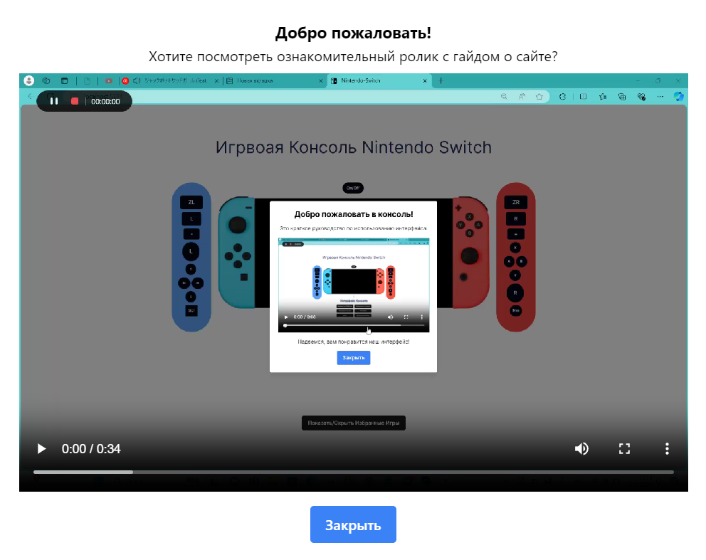

```js
import React, { useEffect, useState } from "react";

const Modal = ({ content, onClose }) => {
    const [isVisible, setIsVisible] = useState(false);

    useEffect(() => {
        setIsVisible(true); // Устанавливаем видимость при монтировании

        const handleKeyDown = (e) => {
            if (e.key === 'Escape') {
                handleClose();
            }
        };

        window.addEventListener('keydown', handleKeyDown);

        return () => {
            window.removeEventListener('keydown', handleKeyDown);
        };
    }, []);

    const handleClose = () => {
        setIsVisible(false); // Убираем видимость при закрытии
        setTimeout(onClose, 200); // Уменьшено время ожидания до 200 мс
    };

    const handleOverlayClick = (e) => {
        if (e.target === e.currentTarget) {
            handleClose();
        }
    };

    return (
        <div
            className="fixed inset-0 bg-black bg-opacity-50 flex items-center justify-center"
            onClick={handleOverlayClick} // Обработчик клика на затемненную область
        >
            <div
                className={`bg-white text-black p-6 rounded shadow-lg w-full max-w-[50rem] transition-transform duration-200 ${
                    isVisible ? 'translate-y-0 opacity-100' : '-translate-y-20 opacity-0'
                }`}
            >
                <p>{content}</p>
                <button onClick={handleClose} className="mt-4 bg-blue-500 text-white px-4 py-2 rounded">
                    Закрыть
                </button>
            </div>
        </div>
    );
};

export default Modal;
```
9. **PowerButton**

- Кнопка включения
- Кнопки громкости

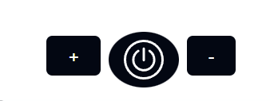

```js
import styles from "../Core.module.scss";
import nintendoSwitchOff from "../../public/nintendo-switch-off.png";
import nintendoSwitchOn from "../../public/nintendo-switch-on.png";
import iconOnOff from "../../public/on-off.svg"
import React from "react";

export default function ConScrOnOff({ isConsoleOn, toggleConsole }) {
    return (
        <div className="flex flex-col items-center">
            <div className="flex items-center">
                <button className={styles.button_volume}>
                    +
                </button>
                {/* Кнопка для переключения состояния консоли и видимости кнопок */}
                <button className={styles.button1} onClick={toggleConsole}>
                    
                </button>
                <button className={styles.button_volume}>
                    -
                </button>
            </div>

            {/* Изображение консоли, которое меняется в зависимости от состояния */}
            <div>
                
            </div>
        </div>
    );
}
```
10. **SettingsInfo**

**Настройки:**
- Громкости
- Яркости
- Языка

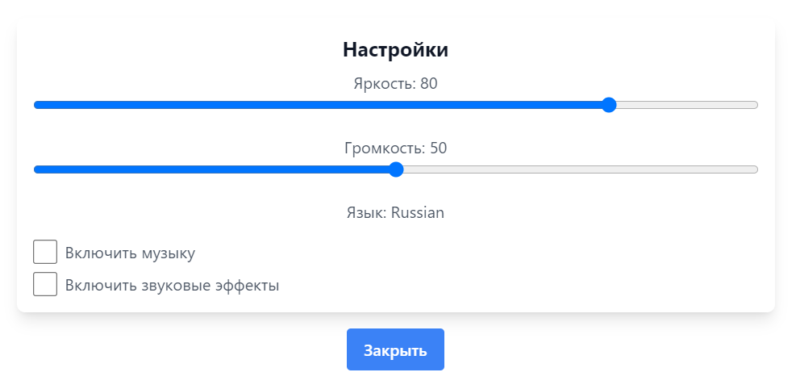

```js
import React, { useState } from "react";

// Компонент для отображения настроек
function SettingsInfo({ settings }) {
    const [volume, setVolume] = useState(settings.volume);
    const [brightness, setBrightness] = useState(settings.brightness);
    const [isMusicOn, setIsMusicOn] = useState(settings.OpenGL); // Состояние для музыки
    const [isSoundEffectsOn, setIsSoundEffectsOn] = useState(settings.SuperSound); // Состояние для звуковых эффектов

    // Обработчики изменения громкости и яркости
    const handleVolumeChange = (event) => {
        setVolume(event.target.value);
    };

    const handleBrightnessChange = (event) => {
        setBrightness(event.target.value);
    };

    // Обработчики изменения состояния чекбоксов
    const handleMusicToggle = () => {
        setIsMusicOn((prev) => !prev);
    };

    const handleSoundEffectsToggle = () => {
        setIsSoundEffectsOn((prev) => !prev);
    };

    return (
        <div className="bg-white shadow-lg rounded-lg p-4">
            <h2 className="text-xl font-bold text-gray-900 mb-2">Настройки</h2>

            {/* Яркость */}
            <p className="text-gray-600">Яркость: {brightness}</p>
            <input
                type="range"
                min="0"
                max="100"
                value={brightness}
                onChange={handleBrightnessChange}
                className="w-full"
            />

            {/* Громкость */}
            <p className="text-gray-600 mt-4">Громкость: {volume}</p>
            <input
                type="range"
                min="0"
                max="100"
                value={volume}
                onChange={handleVolumeChange}
                className="w-full"
            />

            {/* Язык */}
            <p className="text-gray-600 mt-4">Язык: {settings.language}</p>

            {/* Чекбоксы для музыки и звуковых эффектов */}
            <div className="mt-4">
                <label className="flex items-center">
                    <input
                        type="checkbox"
                        checked={isMusicOn}
                        onChange={handleMusicToggle}
                        className="mr-2 w-6 h-6" // Увеличиваем размеры чекбоксов
                    />
                    <span className="text-gray-600">Включить музыку</span>
                </label>

                <label className="flex items-center mt-2">
                    <input
                        type="checkbox"
                        checked={isSoundEffectsOn}
                        onChange={handleSoundEffectsToggle}
                        className="mr-2 w-6 h-6" // Увеличиваем размеры чекбоксов
                    />
                    <span className="text-gray-600">Включить звуковые эффекты</span>
                </label>
            </div>
        </div>
    );
}

export default SettingsInfo;
```
11. **SideLeft**

- Левая сторона кнопок консоли

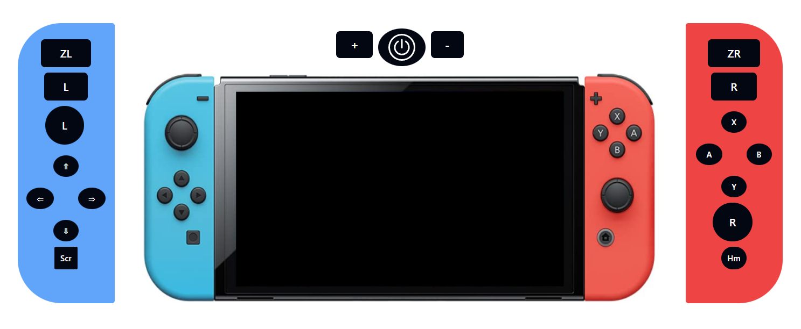

```js
import styles from "../Core.module.scss";

export default function sideLeft() {
    return (
        <div className={styles.side_left}>
            <div className="flex flex-col items-center w-full justify-center">
                <button className={styles.button_direction}>
                    ZL
                </button>
                <button className={styles.button_direction}>
                    L
                </button>
                <button className={styles.button_joystick}>
                    L
                </button>
            </div>
            <div className="flex w-full justify-center flex-col">
                <div className="flex w-full justify-center">
                    <button className={styles.button}>
                        &#8657;
                    </button>
                </div>
                <div className="flex gap-x-5 justify-center">
                    <button className={styles.button}>
                        &#8656;
                    </button>
                    <button className={styles.button}>
                        &#8658;
                    </button>
                </div>
                <div className="flex w-full justify-center">
                    <button className={styles.button}>
                        &#8659;
                    </button>
                </div>
            </div>
            <div className="flex w-full justify-center">
                <button className={styles.button_sreenshot}>
                    Scr
                </button>
            </div>
        </div>
    )
}
```
12. **SideRight**

- Правая сторона кнопок консоли


```js
import styles from "../Core.module.scss";

export default function sideRight() {
    return (
        <div className={styles.side_right}>
            <div className="flex flex-col items-center w-full  justify-center">
                <button className={styles.button_direction}>
                    ZR
                </button>
                <button className={styles.button_direction}>
                    R
                </button>
                <div className="flex w-full justify-center flex-col">
                    <div className="flex w-full justify-center">
                        <button className={styles.button}>
                            X
                        </button>
                    </div>
                    <div className="flex gap-x-5 justify-center ">
                        <button className={styles.button}>
                            A
                        </button>
                        <button className={styles.button}>
                            B
                        </button>
                    </div>
                    <div className="flex w-full justify-center">
                        <button className={styles.button}>
                            Y
                        </button>
                    </div>
                </div>
            </div>
            <div className="flex w-full justify-center">
                <button className={styles.button_joystick}>
                    R
                </button>
            </div>
            <div className="flex w-full justify-center">
                <button className={styles.button_home}>
                    Hm
                </button>
            </div>
        </div>
    )
}
```
13. **SpecialInfo**

- Вывод информации о консоли


```js
import React from "react";
import Special from "../data/Special.js";
function SpecialInfo({ special }) {
    return (
        <div className="mb-4 mt-4 bg-white shadow-lg rounded-lg p-4 ">
            <h2 className="text-xl font-bold text-gray-900 mb-2">Специальные Возможности</h2>
            <p className="text-gray-600">Версия ОС: {special.os}</p>
            <p className="text-gray-600">Год Выпуска: {special.year}GB</p>
            <p className="text-gray-600">Лицензия: {special.licens}</p>
        </div>
    );
}
export default SpecialInfo;
```
14. **ToggleFavGame**

- Кнопка скрытия и показа информации о любимой игре


```js
import { useState } from 'react';

export default function ToggleFavGameButton({ toggleFavGame }) {
    return (
        <div className="flex justify-center my-4">
            <button className="btn text-white" onClick={toggleFavGame}>
                Показать/Скрыть Избранные Игры
            </button>
        </div>
    );
}
```
15. **TutorialModal**

- Модальное окно с видео-гайдом о сайте


```js
// TutorialModal.jsx
import React from 'react';
import Modal from './modal.jsx'; // Импортируем основной компонент модального окна
import video from '../assets/video.mp4'; // Импортируем видеофайл

const GuideModal = ({ isOpen, onClose }) => {
    const content = (
        <div>
            <h2 className="text-lg font-bold text-center">Добро пожаловать!</h2>
            <p className="mb-2 text-center">Хотите посмотреть ознакомительный ролик с гайдом о сайте?</p>
            <div className="flex justify-center">
                <video width="100%" controls className="max-w-full">
                    <source src={video} type="video/mp4" /> {/* Используем импортированное видео */}
                    Ваш браузер не поддерживает воспроизведение видео.
                </video>
            </div>
        </div>
    );

    return (
        <Modal content={content} onClose={onClose} />
    );
};

export default GuideModal;
```

16. **UserInfo**

- Информация о пользователе


```js
import React from "react";

// Компонент для отображения информации о пользователе
function UserInfo({ user }) {
    return (
        <div className="bg-white flex justify-start flex-col items-center h-[20rem] w-fit shadow-lg rounded-lg mx-4">
            <h1 className="text-xl pb-2 pt-5 font-bold text-gray-900">Пользователь</h1>
            <div className="flex pt-5 pb-0 px-8">
                <div className="">
                    
                </div>
                <div className="">
                    <div className="grid grid-cols-2 gap-4">
                        <p className="py-2 text-gray-600 font-semibold">Имя:</p>
                        <span className="border border-indigo-400 rounded-lg px-2 py-1">{user.username}</span>
                        <p className="py-2 text-gray-600 font-semibold">Уровень:</p>
                        <span
                            className={`rounded-lg px-2 py-1 
                        ${user.level < 10 ? 'border-green-400' :
                                    user.level < 20 ? 'border-blue-700' :
                                        'border-red-600'} border`}
                        >
                            {user.level}
                        </span>
                        <p className="py-2 text-gray-600 font-semibold">Игры, сыгранные:</p>
                        <span className="border border-indigo-400 rounded-lg px-2 py-1">{user.gamesPlayed}</span>
                        <p className="py-2 text-gray-600 font-semibold">Друзья:</p>
                        <span className="border border-indigo-400 rounded-lg px-2 py-1">
                            {user.friends.join(", ")}
                        </span>
                    </div>
                </div>
            </div>
        </div>
    );
}

export default UserInfo;
```

## Основной файл проекта

- Файл позволяющий реализовать сам сайт.

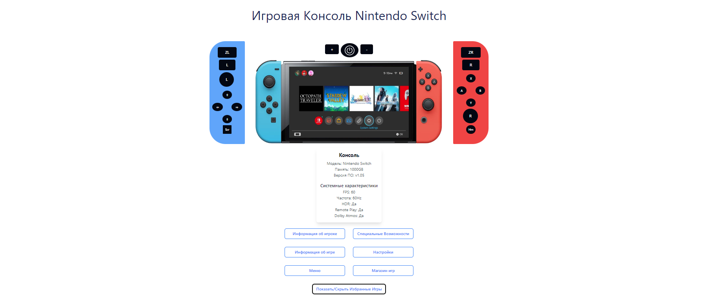

```js
import './App.css'; // Стили для приложения
import Header from "./components/header.jsx"; // Компонент "Header" (заголовок)
import SideLeft from "./components/SideLeft.jsx"; // Левый блок
import ConScrOnOff from "./components/PowerButton.jsx"; // Компонент для включения/выключения экрана консоли
import SideRight from "./components/SideRight.jsx"; // Правый блок
import Modal from "./components/modal.jsx"; // Компонент модального окна
import InterfaceButtons from "./components/InterfaceButtons.jsx"; // Компонент для отображения кнопок интерфейса
import FavGame from "./components/FavGame.jsx"; // Компонент с избранными играми
import ToggleFavGameButton from "./components/ToggleFavGameButton.jsx"; // Компонент кнопки для показа/скрытия
import TutorialModal from "./components/TutorialModal.jsx"; // Импортируем компонент модального окна обучения
import ConsoleInfo from "./components/ConsoleInfo.jsx";

import { useState, useEffect } from "react"; // Хук useState для управления состоянием компонентов
import { user1, console1, game1, settings1, menu1, store1, system1 } from "./data/config.js"; // Импортируем данные для пользователя, консоли, игры и т.д.

function App() {
    const [modalContent, setModalContent] = useState(""); // Состояние для контента модалки
    const [isModalOpen, setIsModalOpen] = useState(false); // Состояние для управления открытием/закрытием модалки
    const [isButtonVisible, setIsButtonVisible] = useState(false); // Состояние для управления видимостью кнопок интерфейса
    const [isFavGameVisible, setIsFavGameVisible] = useState(false); // Состояние для видимости блока с избранными играми
    const [isTutorialModalOpen, setIsTutorialModalOpen] = useState(true); // Состояние для управления открытием/закрытием модального окна обучения
    const [isConsoleOn, setIsConsoleOn] = useState(false); // Состояние для управления изображением консоли

    const openModal = (content) => {
        setModalContent(content); // Устанавливаем контент для модалки
        setIsModalOpen(true); // Открываем модалку
    };

    const closeModal = () => {
        setIsModalOpen(false); // Закрываем модалку
    };

    const closeTutorialModal = () => {
        setIsTutorialModalOpen(false); // Закрываем модальное окно обучения
    };

    const toggleButtonsVisible = () => {
        setIsButtonVisible(prevState => !prevState); // Переключаем видимость кнопок
    };

    const toggleFavGame = () => {
        setIsFavGameVisible(prevState => !prevState); // Переключаем видимость блока с играми
    };

    const toggleConsole = () => {
        setIsConsoleOn(prevState => !prevState); // Переключаем изображение консоли
        toggleButtonsVisible(); // Переключаем видимость кнопок интерфейса
    };

    return (
        <>
            <Header />
            <div className='flex justify-between'>
                <SideLeft />
                {/* Передаем состояние и функцию управления в ConScrOnOff */}
                <ConScrOnOff isConsoleOn={isConsoleOn} toggleConsole={toggleConsole} />
                <SideRight />
            </div>
            <div className="flex flex-col items-center justify-center text-blue-950">

                {isConsoleOn && <ConsoleInfo console={system1} />}
                {/* Кнопки интерфейса будут видны, если isButtonVisible = true */}
                <div
                    className={`transition-opacity duration-500 ${isButtonVisible ? 'opacity-100 pointer-events-auto' : 'opacity-0 pointer-events-none'}`}>
                    <InterfaceButtons
                        openModal={openModal}
                        user1={user1}
                        console1={console1}
                        game1={game1}
                        settings1={settings1}
                        menu1={menu1}
                        store1={store1}
                        system1={system1}
                    />
                </div>

                {/* Модалка для обучения */}
                {isTutorialModalOpen && <TutorialModal onClose={closeTutorialModal} />}

                {/* Модалка */}
                {isModalOpen && <Modal content={modalContent} onClose={closeModal} />}
            </div>

            {/* Кнопка для показа/скрытия компонента FavGame */}
            <ToggleFavGameButton toggleFavGame={toggleFavGame} isFavGameVisible={isFavGameVisible} />

            {/* Анимация плавного показа/скрытия блока с играми */}
            <div className={`transition-all duration-700 ease-in-out overflow-hidden ${isFavGameVisible ? 'max-h-full opacity-100' : 'max-h-0 opacity-0'}`}>
                <FavGame />
            </div>
        </>
    );
}

export default App;
```

## UML-диаграмма
Ниже представлены UML-диаграммы классов и компонентов, которые отражают структуру проекта и взаимоотношения между основными сущностями.

UML-диаграмма классов
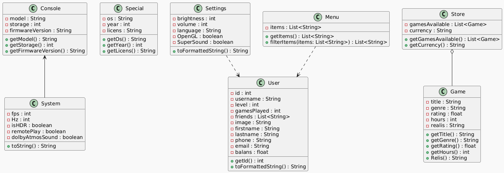


UML-диаграмма компонентов
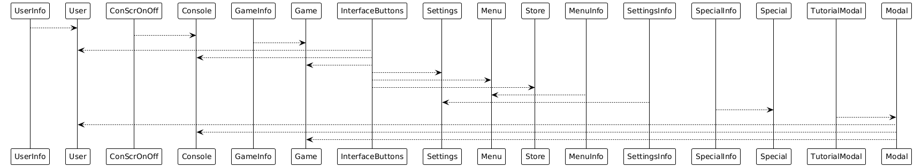

## Процесс рефакторинга

### Что такое рефакторинг?
Рефакторинг — это процесс улучшения структуры кода без изменения его внешнего поведения. Основная цель — сделать код более чистым, легко читаемым и поддерживаемым.

### В процессе рефакторинга было изменено:
1. **Оптимизация структуры классов**:
    - Были объединены некоторые повторяющиеся функции в базовые классы для уменьшения дублирования кода.
    - Переработана логика управления настройками консоли для более гибкого использования.

2. **Улучшение читаемости кода**:
    - Были добавлены комментарии в ключевых частях программы для улучшения понимания кода другими разработчиками.
    - Упрощены сложные участки логики.

3. **Улучшение производительности**:
    - Были проведены оптимизации в части рендеринга изображений и интерактивных элементов для более быстрой загрузки страниц.

4. **Работа с ветками и разрешение конфликтов**:
    - В ходе разработки возникли несколько конфликтов при слиянии веток. Все они были успешно разрешены благодаря использованию системы контроля версий Git и пониманию, как корректно объединять изменения от разных разработчиков.


### Что такое Код-ревью?
Код-ревью — это процесс проверки кода, чтобы найти и устранить ошибки, улучшить читаемость, оптимизировать производительность, и убедиться, что код соответствует стандартам качества и требованиям проекта. Во время код-ревью рассматриваются такие аспекты, как:

- Логические ошибки и баги.
- Оптимизация производительности.
- Соответствие кода стандартам и стилям.
- Читаемость и структура кода.
- Обоснованность использования паттернов и архитектурных решений.


## Заключение
Проект был успешно завершен в соответствии с техническим заданием. Все обязательные классы реализованы, сайт обладает интерактивным и привлекательным дизайном, а также выполнена работа с ветками в Git. Процесс рефакторинга позволил улучшить качество кода и его производительность.
